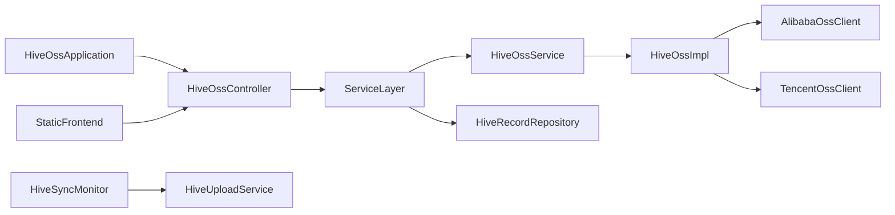

# hive-oss 模块总览

本目录为 hive-oss 项目的功能模块说明，采用「总览 + 分模块」文档结构，覆盖模块职责、依赖关系与启动入口。

## 项目概览

hive-oss 是单 Maven 模块的 Spring Boot 应用，提供多云 OSS（阿里云、腾讯云）的统一管理：文件列表/搜索、上传、下载、解冻、删除及与本地 DB 的同步；并集成数据库备份与恢复（db2oss）。在该集成中，hive-oss 负责业务编排与 OSS 上传/下载，db2oss Starter 负责本地 MySQL 备份与恢复核心流程。

## 模块关系图

## 启动入口

| 类型 | 入口 | 说明 |
|------|------|------|
| 应用主入口 | `cc.cc3c.hive.oss.HiveOssApplication` | Spring Boot `main`，启动 Web 与调度 |
| HTTP API | `cc.cc3c.hive.oss.controller.HiveOssController` | REST 接口，供静态前端调用，详见 [静态前端](static-frontend.md) |
| 上传目录监听 | `cc.cc3c.hive.oss.sync.HiveSyncMonitor` | `ApplicationReadyEvent` 后启动对上传目录的监控 |

## 模块导航

| 模块 | 文档 | 职责摘要 |
|------|------|----------|
| 后端 API | [backend-api.md](backend-api.md) | REST 接口、请求/响应 VO、与前端对接 |
| 服务编排 | [service-orchestration.md](service-orchestration.md) | 上传/下载/同步服务与 OSS 门面、配置与调度 |
| OSS 适配层 | [oss-adapter.md](oss-adapter.md) | 阿里云/腾讯云客户端、统一 HiveOss 接口与实现 |
| 同步与监控 | [sync-and-watcher.md](sync-and-watcher.md) | 上传目录监听、远程同步触发 |
| 静态前端 | [static-frontend.md](static-frontend.md) | 首页、分类/分组、文件管理页面与 API 调用 |

## db2oss 集成说明（AutoConfiguration）

### 自动装配行为

- `mysql-backup-spring-boot-starter` 默认注册三个核心 Bean：`BackupProperties`、`BackupService`、`RestoreService`。
- 三个 Bean 均基于 `@ConditionalOnMissingBean` 创建，hive-oss 可按需提供同类型 Bean 覆盖默认实现。
- `BackupProperties` 由 `backup.*` 直接绑定生成，避免业务侧手工拼装配置对象。

### 配置入口与分组

- 统一配置前缀：`backup.*`
- 关键分组：
  - `backup.mysql`：连接目标库、客户端目录、锁表策略等备份基础参数
  - `backup.restore`：恢复输入文件、是否重建库、恢复临时目录
  - `backup.retention`：本地保留策略（如保留天数）
  - `backup.dir`：备份产物输出目录
  - `backup.security`：异常场景下的清理策略（如失败后删除中间产物）

### 职责边界（hive-oss vs db2oss）

- hive-oss：按业务流程触发备份/恢复、接入加密能力、将产物上传到 OSS、按需从 OSS 下载后恢复。
- db2oss Starter：提供 dump/gzip/manifest 等本地备份产物生成能力，以及恢复执行能力。
- 通过上述边界，hive-oss 关注“编排与存储流转”，db2oss 关注“备份与恢复引擎”。

## 外部依赖（高层）

- **hive-domain**：实体 `HiveRecord`、枚举 `HiveStorageProvider`/`HiveRecordStatus`/`HiveDownloadStatus`、仓储 `HiveRecordRepository`
- **hive-encryption-starter**：加密配置与加解密能力（上传/下载时可选）
- **mysql-backup-spring-boot-starter**（db2oss）：通过 AutoConfiguration 提供 `BackupProperties`、`BackupService`、`RestoreService`，以 `backup.*` 作为统一配置入口，供 hive-oss 编排调用
- **Spring Boot**：Web、Validation、JPA、配置
- **阿里云 OSS SDK**、**腾讯云 COS SDK**：对象存储操作
